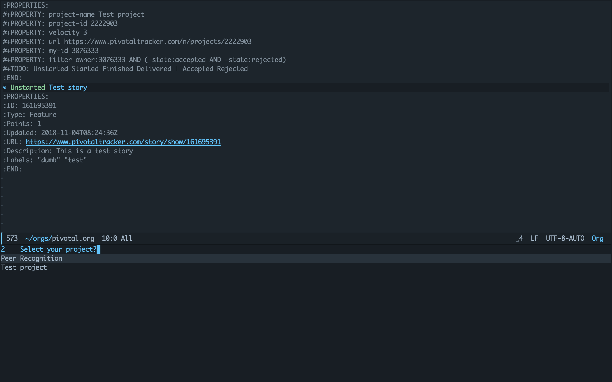

# org-pivotal
## Summary
org-pivotal is a utility to extend org-mode with Pivotal Tracker abilities

## Screen shots


## Initial setup
Before using the tracker you must setup your pivotal API key in Emacs. You can obtain the key from the [Profile](https://www.pivotaltracker.com/profile) link in the Pivotal Tracker web application.

After obtaining the ky, you have to manually add it to your .emacs.d or .spacemacs like this:

``` emacs-lisp
(setq org-pivotal-api-token "your-secret-token")
```

If you don't want to set it directly in your Emacs's .el file, you can export it to shell environment and use `getenv` to read it from within Emacs

``` emacs-lisp
(setq org-pivotal-api-token (getenv "PIVOTAL_API_TOKEN"))
```

To enable this package automatically after opening org-mode, add this line to your Emacs's .el file

``` emacs-lisp
(add-hook 'org-mode-hook 'org-pivotal-mode)
```

## Keybindings

| Keybindings        | Interactive commands                                | Description                                   |
|--------------------|-----------------------------------------------------|-----------------------------------------------|
| <kbd>C-c ( i</kbd> | <kbd>M-x org-pivotal-install-project-metadata</kbd> | Install selected project's metadata to buffer |
| <kbd>C-c ( f</kbd> | <kbd>M-x org-pivotal-pull-stories</kbd>             | Pull stories to org buffer                    |
| <kbd>C-c ( p</kbd> | <kbd>M-x org-pivotal-push-story</kbd>               | Push current story to Pivotal                 |

## Contributing
Yes, please do! See [CONTRIBUTING](https://github.com/org-pivotal/org-pivotal/blob/master/CONTRIBUTING.md) for guidelines.

## License
See [COPYING](https://github.com/org-pivotal/org-pivotal/blob/master/COPYING). Copyright (c) 2018 Huy Duong.
